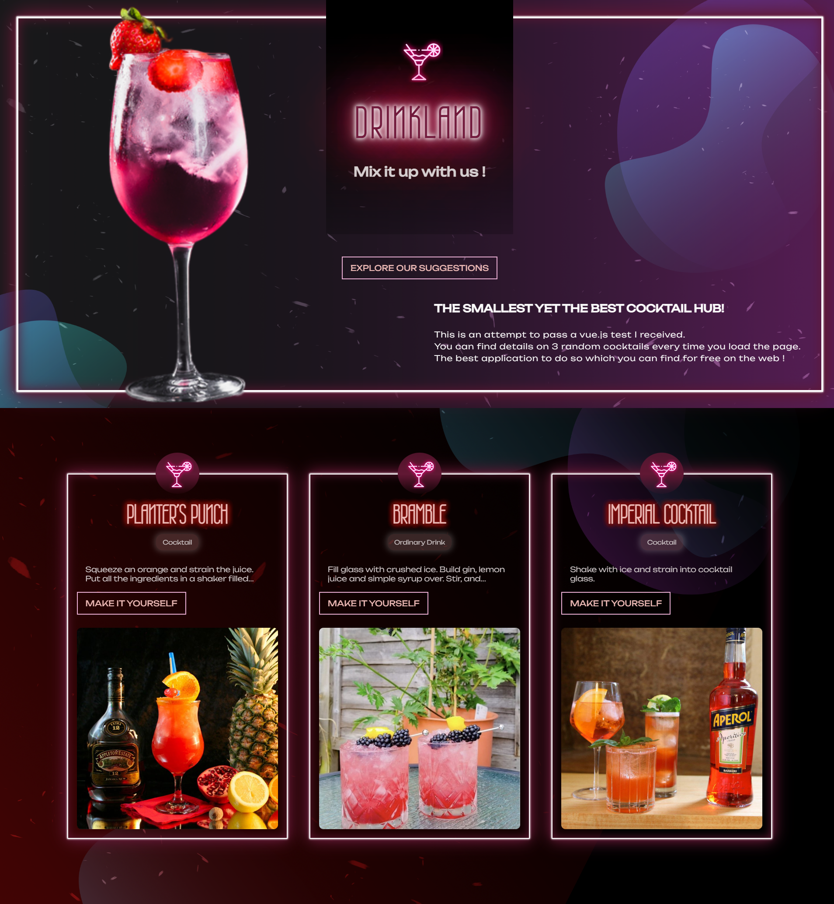

# [DRINKLAND](https://ysyassine.github.io/drinkland/)

## THE SMALLEST YET THE BEST COCKTAIL HUB!

Welcome to this app, which was created as part of a technical test that I had to pass using vue.js. It is a demonstration of my skills and abilities as a developer.

## Live demo

You can try the website at: https://ysyassine.github.io/drinkland/



## Running the Project

This project was created using `Vite`. In order to run the project, you will need to have Vite installed on your system.

### Installing Vite

To install Vite, open a terminal and run the following command:

```bash
npm install -g vite
```

### Running the app

Once Vite is installed, navigate to the root directory of the project and run the following command:

```bash
npm run dev
```

## Website overview

### Landing Page


### Cocktails List


### Make Cocktail Popup


