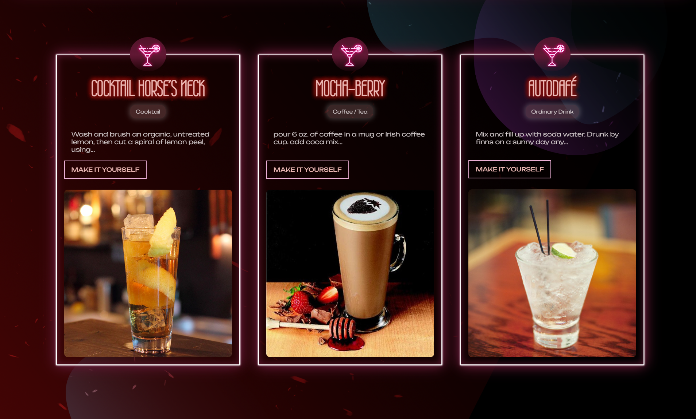

# [DRINKLAND](https://ysyassine.github.io/vade-test/)

## Live demo

You can try the website at: https://ysyassine.github.io/vade-test/

## THE SMALLEST YET THE BEST COCKTAIL HUB!

This is an attempt to pass the vue.js test I received from Vade.
You can find details on 3 random cocktails every time you load the page.
The best application to do so which you can find for free on the web !

## Website overview

### Landing Page

### Cocktails List

### Make Cocktail Popup

